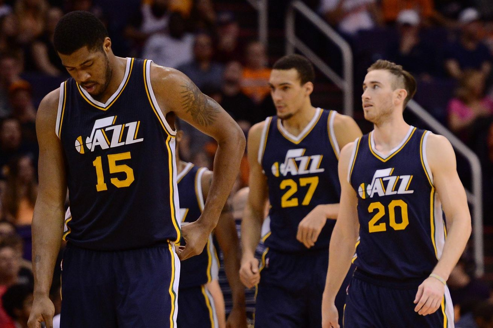

```{r setup, include=FALSE}
knitr::opts_chunk$set(echo = TRUE)
library(pander)
```

##Introduction: A Dark Day In Utah

On July 4, 2017, All-Star Small Forward Gordon Hayward left the Utah Jazz to join the Boston Celtics. In a move that stunned the Jazz players, coaches, and front office, Hayward bolted the Wasatch Front to play with several big-name scorers including the shoot-first, ask-questions-later PG Isaiah Thomas and former coach Brad Stevens in a move that he claimed would help him to "win a championship."



Various media outlets have painted a dismal picture for the reigning Northwest Division champions; a month after beating the LA Clippers (a team also decimated this off-season) in the opening round of the playoffs and capping off a 51-win 2016-17 season, the Jazz are now not expected to compete for a playoff spot. But was Hayward really the heart and soul of the Utah Jazz? The team retains its best defender and arguably most talented player in Rudy Gobert, adds young talent in Donovan Mitchell, and brought in a top-notch distributor at PG in Ricky Rubio. Using some simulation-based methods, I plan to simulate the 2017-18 NBA season and see what shakes out. What's a reasonable range for Utah's predicted win/loss record?

##2017 Season
Each player's game stats are shown in the table below. 
```{r season, include = TRUE, echo = FALSE}
player <- read.csv("Player_Stats.csv", header = TRUE)
names(player)[2] <- c("Name")

sea <- read.csv("Per_Season.csv", header = TRUE)
pander(player)
```


##Utah's Current Roster


##Simulations

Basically, I'm going to simulate game by game scoring distributions for each player from truncated normal distributions, then add them up to get a game-wide scoring distribution for the entire team. In 2017, the average number of points scored against the Jazz was 96.8 (they were a solid defensive squad and may actually improve in that regard with the addition of Rubio and a healthy Derrick Favors at the 4), so the following criteria will determine if the Jazz "win" a simulated game. 

+ JAZZ WIN!:Jazz score 96.8 or more points
+ JAZZ SHOULDA WON!: Jazz score fewer than 96.8 points
 

##Results
```{r functions_and_such, include = FALSE}
setwd("C:/Users/Paul/Documents/UtahJazzPredictions")
player <- read.csv("Player_Stats.csv", header = TRUE)
names(player)[2] <- c("Name")

sea <- read.csv("Per_Season.csv", header = TRUE)

#simulates Gordon's replacement with half the scoring production
#how do I handle replacing Hill with Rubio?

#simulate points per 


#function has to be fed a player matrix with variable PTS
simulate.season <- function (player, num.season){
  
  ppm <- player$PTS/36 #simulates the number of points per minute per player
  
  
  
  
  #think of a prior distribution: 
  ##Year to year variation could lead some players to be better or worse than the year before: 
  #prior distribution of N(0,2)
  
  prior <- rnorm(nrow(player),0,2)
  
  sigma.sq <- var(ppm) #variance of the likelihood
  
  
  wins <- c()
  total.wins <- c()
  for(szns in 1:num.season){ 
    for (games in 1:82){
      
      #sample the posterior distributions
      num.sims <- 1000
      pred.points <- matrix(0,ncol = nrow(player), nrow = num.sims)
      
      #par(mfrow = c(3,5))
      #samples distributions for each player
      for (j in 1:nrow(player)){
        pred.points[,j] <- rnorm(num.sims,mean = (2*ppm[j]/(sigma.sq/15 + 2)),sd = (.5 + nrow(player)/sigma.sq)^-.5)  
        #plot(pred.points[,j], main = player$Name[j], type = "l");abline(h = mean(pred.points[,j]), col = "tomato")
      }
      
      #no issues with convergence or anything like that thankfully
      mean.pred <- apply(pred.points,2,mean) #posterior points per minute
      
      #distribute per number of minutes
      num.mins <- rep(0,nrow(player)) #simulates the number of minutes with little variation 
      for (j in 1:nrow(player)){
        num.mins[j] <- rnorm(1, sea$MP[j],2)
      }
      
      
      
      
      predicted.ppg <- num.mins * mean.pred
      
      #sample index from uniform between 4:7
      reserves <- sample(4:7, 1) #samples the number of reserves that play in a game
      index <- sample(6:15,reserves,replace = FALSE)
      scored <- sum(predicted.ppg[1:5],predicted.ppg[index]) 
      #take the sampled distribution for each player and multiply by the expected minutes 
      
      ##OK but there's a problem! Only a handful of players actually make it into each game. The bottom few may not play
      #more than a couple games...
      wins[games] <- ifelse(scored > 96.8, 1,0)
      
    }
    total.wins[szns] <- sum(wins[])
  }
  
  return(list(wintotal = total.wins, numseasons = num.season, goJazz = c("GO JAZZ GO! #takenote")))
}


```


###Exploratory Analysis
###Scoring Distributions
Gordon Hayward was the highest-scoring player on the Jazz in 2016-17. In 2018, this will have to change - the Jazz are going to rely on Ricky Rubio, Rodney Hood, and Donovan Mitchell to pick up some additional scoring loads while hoping Joe Ingles can consistently score from 3 point range. 
 
```{r}
library(png);library(grid)
img <- readPNG("figures/hardwood.png") 
g <- rasterGrob(img, interpolate=TRUE, width = 2, height = 3)


player.start <- player <- player[c(1,2,5,10,6,8,4,11,12,13,14,15),] 


ggplot(player.start[1:5,], aes(Name)) + annotation_custom(g, xmin=-Inf, xmax=Inf, ymin=-Inf, ymax=Inf) + geom_bar(aes(weight=PTS), fill = c("#002B5C","#F9A01B","#00471B","#002B5C","#F9A01B"),color = "white") + ggtitle(label = "Jazz Scorers")+
  xlab(label = "Average PPG") + ylab(label = "Name") + theme(legend.position="none") + theme_bw()
  

```


###

##Replacing Hayward as a shooter
Since Gordon Hayward provided the most offensive output of anyone on the team, the 

###Donovan Mitchell
###Average SF: 
###Garbage SF: 

##Joe Ingles is THE MAN!
"Every day is a good day to be a Jazz fan" - Joe Ingles. 
What to say about good old Jinglin' Joe Ingles? The guy is seriously legit. The dude hits clutch threes and plays big in front of the home crowd. But nobody is making the argument that this little-used SF is a full time starter in the NBA, especially at the 3. 


